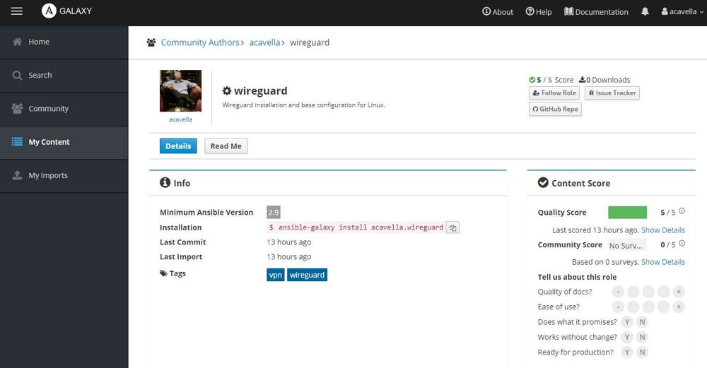

Yesterday I completed and published my first official Ansible Role. Much of the motivation for this project came from the great work Jeff Geerling is doing around Ansible. If you are interested in getting started with Ansible, I highly suggest checking out his Ansible 101 series.

The purpose of this role is to install Wireguard on Linux. The role includes OS specific tasks that should allow it to work on any system. The role installs a simple server and generates the keys for a single client user. It has been tested on Debian, Ubuntu, CentOS and Fedora.

- [Github Source](https://github.com/acavella/ansible-role-wireguard)
- [Ansible Galaxy](https://galaxy.ansible.com/ui/standalone/roles/acavella/wireguard/)

