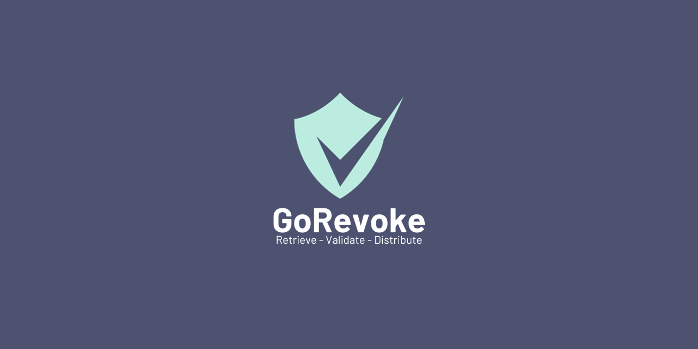
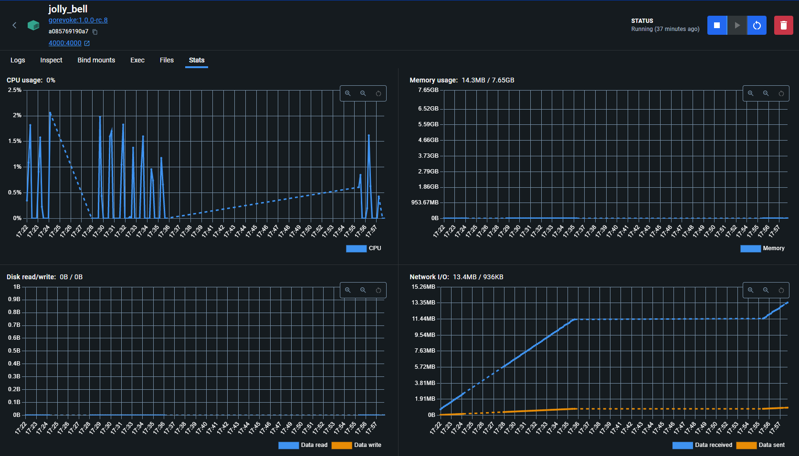

# GoRevoke
GoRevoke is a standalone Certificate Revocation List Distrution Point written in Go, designed to be lightweight and fully self-contained. Using a simple configuration, GoRevoke automates downloading and serving of remote CRLs. GoRevoke is based on, revoke, a shell based script providing similar function.

## Features
- Cross-platform compatiblity; tested on Linux and Windows
- Native and containerized deployment options
- Retrieve remote CRL data via HTTP or HTTPS
- Validation and confirmation of CRL data
- Built-in webserver alleviates the need for additional servers
- Ability to retrieve and serve an unlimited number of CRL sources
- Support for full and delta CRLs

## Performance
